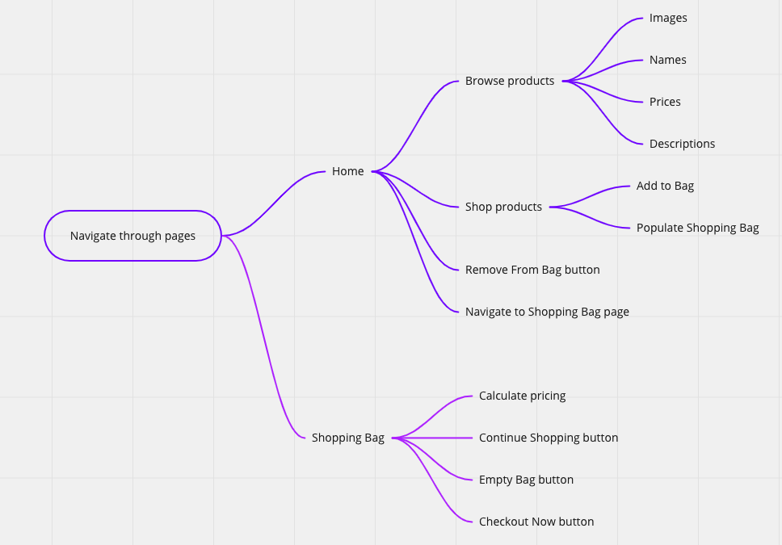
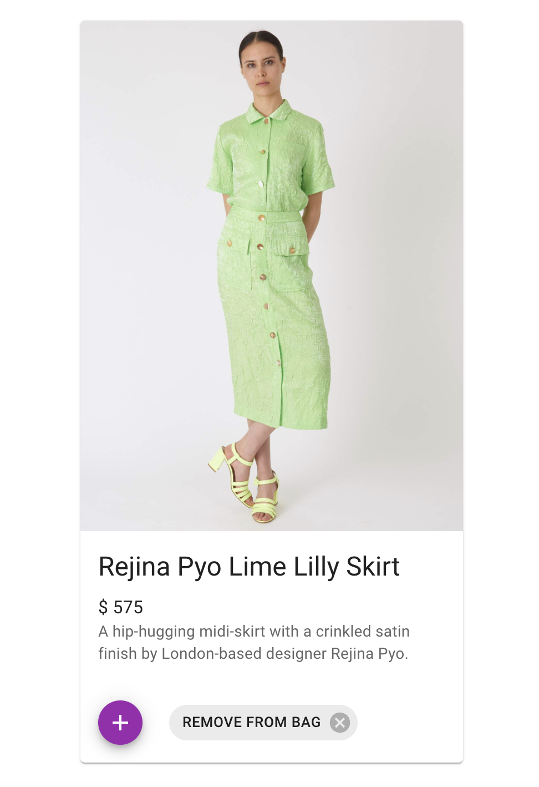
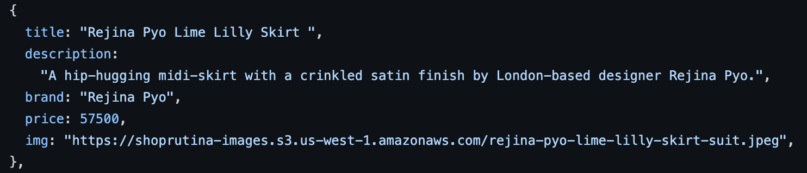

# Overview: A Simple React E-Commerce Store

### Overview areas I'll be covering:
1. Simple Features
2. Product Model Build
3. AWS S3 Data Hosting

##### Over the years, my hands have been in many pots -- building software is yet another pot that I've dug my hands into. In this piece, I'll be sharing a bit of a more well-rounded view of what I mean by that. First off, know that this piece is a multi-part article that works at the intersection of design and development.

##### Here, I’ll focus on introducing the shop’s front-end, aka the client-side, aka what users see and interact with on their digital screens. Though I also built the backend to tie this full-stack project together, this piece is dedicated to sharing how I built the front-end, starting from nothing to creating something users could see and interact with. This multi-part series won’t be a step-by-step of how to create an e-commerce online shopping experience, but instead will be my broken-down approach to share & show how I built Shop Rutina.

_From whipping up a React-based application via ```npx create-react-app ecomm-shop``` terminal command → writing code for design and functionality → calculating the product models and using images of listed products I’ve modeled in past years → incorporating AWS S3 for product data hosting → ideating the online shopping interactions on main pages → building and connecting the client-side (front-end) to the server-side (back-end) and everything in between, this simple build was a way for me to combine a mix of skills I’ve learned (and strive to continue learning) in the programming pot._

**1. Simple Features**




**2. Product Model Build**



**Design:** Visually speaking, every e-commerce store has a similar general theme that includes identifying products to sell and listing them in a way that make it easy for shoppers to buy. I chose to work with [Material UI](https://mui.com/) which is React's component library that uses [Google's Material Design System](https://material.io/design) with ready-to-use components that are also customizable.

**Development:** As for building the product model, I opted to list shop items in an array of objects, storing the data for the products in key: value form. I created 5 properties for each object including _title_, _description_, _brand_, _price_, and _image_, then matched each with its corresponding value. For the purpose of mixing in past and present skills, I included images of products that I modeled in a past life to personalize the shop.

**3. AWS S3 Data Hosting**



**AWS S3:** [Amazon's Simple Storage Service](https://aws.amazon.com/s3/) enables developers to create buckets to store, retrieve and later implement objects by generating ‘Object URLs’ which are essentially direct links to the data files that were uploaded into the cloud. [AWS in Plain English](https://aws.plainenglish.io/) published my [AWS S3 visual guide](https://aws.plainenglish.io/storing-retrieving-implementing-objects-using-aws-s3-e2b206e98623) that I created and navigated through to store my product model data for Shop Rutina. In that article, you'll learn the specific steps it takes to upload data files from your local machine and store them in the cloud for easy retrieval with step-by-step screenshots.